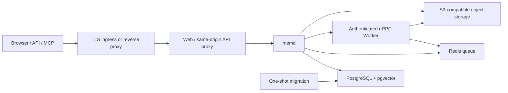

# Production deployment

This document defines the supported production deployment shapes for `mem`.
Both profiles use the same first-party images and runtime contract; they differ
only in where stateful dependencies run and which workloads can scale.

> [!IMPORTANT]
> The deployment assets are suitable for private self-hosting. Do not expose a
> `mem` installation as a public multi-tenant service until the hosted
> authentication and abuse-control work in
> [issue #65](https://github.com/bytefolk/mem/issues/65) is complete.
> The Helm profile is the intended foundation for that service, but
> horizontal scaling alone does not make the current login/session model
> Internet-service grade.

## Choose a profile

| Profile | Application workloads | PostgreSQL / Redis / objects | Use when |
| --- | --- | --- | --- |
| Single-node Compose | Web, memd, Worker and one-shot migration on one Linux host | Local containers with named volumes | A personal, team, edge or evaluation installation where simple recovery matters more than node HA |
| Multi-node Helm | Replicated Web and Worker plus one memd on Kubernetes | External PostgreSQL, Redis and S3-compatible storage | A private platform or future hosted service that needs Web/Worker scaling and node-failure tolerance |

The Helm chart intentionally does not install PostgreSQL, Redis, MinIO or their
operators. Stateful HA has a different failure, upgrade and backup lifecycle;
use a managed service or an independently operated cluster.



## Production invariants

The production runtime fails closed when it sees development defaults:

- `MEM_RUNTIME_PROFILE=production`;
- an explicit PostgreSQL URL, Redis URL and S3 configuration;
- `MEM_REGISTRATION_MODE=first_user` or `disabled`, never `open`;
- a 32-byte HMAC key when a Worker is enabled;
- no wildcard CORS origin;
- `MEM_AUTO_MIGRATE=false` on the long-running memd instance.

Only the Web edge is exposed. PostgreSQL, Redis, object storage, memd and the
Worker stay on private networks. Web proxies `/v1/` to memd on the same origin,
so production does not need permissive CORS.

The default AI profile is `local-fast-v2`, with all Worker model defaults empty.
This starts without downloading model weights or sending data to a model
provider. Configure model runtimes, provider credentials and network egress
only as an explicit operator action.

## Build and publish images

Use an immutable version for all three images. The example below builds the
model-free Worker; optional heavy extras must be explicitly selected.

```bash
export MEM_VERSION=0.1.2
export MEM_REGISTRY=registry.example.internal/mem

docker build \
  --build-arg VERSION="$MEM_VERSION" \
  -t "$MEM_REGISTRY/server:$MEM_VERSION" server
docker build \
  -t "$MEM_REGISTRY/worker:$MEM_VERSION" worker
docker build \
  -t "$MEM_REGISTRY/web:$MEM_VERSION" web

docker push "$MEM_REGISTRY/server:$MEM_VERSION"
docker push "$MEM_REGISTRY/worker:$MEM_VERSION"
docker push "$MEM_REGISTRY/web:$MEM_VERSION"
```

If ASR, CLIP or face processing is deliberately enabled, build a separate
Worker artifact with `--build-arg WORKER_EXTRAS=asr`,
`--build-arg WORKER_EXTRAS=clip` or a comma-separated combination such as
`asr,clip,face`. Treat that image as a different capacity class and schedule it
on nodes sized for the selected models.

Before promoting images, run:

```bash
make test-deploy
MEM_VALIDATE_BUILD_IMAGES=1 make test-deploy
```

The first command validates Compose and Helm. The second also builds all three
images from the current checkout.

## Single-node Compose

### Host and network

Start with a dedicated Linux VM with:

- 4 vCPU, 8 GiB memory and 80 GiB durable disk for the model-free baseline;
- 8 vCPU, 16 GiB or more when local model processing is enabled;
- Docker Engine and Docker Compose v2;
- enough additional disk for PostgreSQL, original objects, backups and model
  cache;
- outbound access only to the registries and model/provider endpoints that are
  intentionally used.

The checked-in default binds Web to `127.0.0.1:8080`. Keep it that way when a
reverse proxy runs on the same host. If a private load balancer must reach the
host directly, set `MEM_BIND_ADDRESS` to the host's private address and restrict
the firewall source to that load balancer. Never publish ports 5432, 6379,
9000, 8080 (memd) or 50051.

Terminate HTTPS at a maintained reverse proxy or load balancer. Forward to
`http://127.0.0.1:8080`, preserve the `Host` and `X-Forwarded-*` headers, and
set an upload-body limit at least as large as `MEM_MAX_BODY_SIZE`.

The web container is itself a reverse proxy and is the authority for
`X-Content-Type-Options`, `X-Frame-Options` and `Referrer-Policy`; it sets them
on every response it serves and drops the copies `memd` sends so they do not
arrive twice. `Content-Security-Policy`, `X-XSS-Protection` and
`Content-Disposition` come from `memd`, because they depend on what the response
actually is. If your terminating proxy sets the first three as well, set them
there or here, not both, or a client receives two values for one header.

### Configure and start

From the repository root:

```bash
cd deploy/compose
./generate-env.sh
chmod 600 .env

docker compose --env-file .env -f compose.yaml config --quiet
docker compose --env-file .env -f compose.yaml up -d --build --wait
docker compose --env-file .env -f compose.yaml ps
curl --fail http://127.0.0.1:8080/healthz
```

`generate-env.sh` refuses to overwrite an existing file and creates random
PostgreSQL, Redis, MinIO and Worker-auth secrets. `.env` is ignored by Git.
Store an encrypted copy in the team's secret manager; losing it can make the
volumes inaccessible even if their bytes survive.

The startup order is:

1. PostgreSQL, Redis and MinIO become healthy;
2. MinIO creates a private bucket;
3. `mem-migrate` applies the embedded schema exactly once and exits;
4. Worker and memd start with authenticated internal gRPC;
5. Web starts after memd is ready.

Inspect a failure without printing the `.env` file:

```bash
docker compose --env-file .env -f compose.yaml ps
docker compose --env-file .env -f compose.yaml logs --tail=200 migrate memd worker web
```

### First account and login

The default `MEM_REGISTRATION_MODE=first_user` atomically allows exactly one
account. Create that owner through the Web registration screen, then confirm
that a second registration is rejected. Use a unique password generated by a
password manager.

Current password login is appropriate only inside the private deployment
boundary: it does not yet provide the full hosted-service controls tracked by
#65, such as identity-provider integration, service-grade session protection,
rate limits and account recovery. For a private installation, add VPN, private
network access or an identity-aware proxy in front of mem. Do not use
`MEM_REGISTRATION_MODE=open` in production; the server rejects it.

Set `MEM_REGISTRATION_MODE=disabled` before first start only when users are
provisioned through another controlled process. With no existing user, that
setting leaves nobody able to register.

### Data and resource layout

| Volume | Contents | Recovery role |
| --- | --- | --- |
| `postgres-data` | Users, metadata, memory, indexes and job state projections | System of record; back up with `pg_dump` |
| `minio-data` | Original file/object bytes | System of record; mirror with the backup script |
| `redis-data` | Durable async queue and Worker replay window | Operational state; AOF is enabled |
| `worker-cache` | Downloaded model/runtime cache | Rebuildable; not included in backups |

The Compose backend network is marked `internal`. That is correct for the
model-free baseline. If the Worker must call Ollama on another host or an
approved model provider, create a site-specific Compose override that attaches
only the Worker to a controlled egress network and changes the relevant
provider URL. Do not remove isolation from PostgreSQL, Redis, MinIO or memd.

### Backup

The backup contract is PostgreSQL plus the complete object bucket. Redis is not
the source of record and the Worker cache is reproducible. Before a
point-in-time backup, stop writes and let any in-flight Worker job finish:

```bash
cd deploy/compose
docker compose --env-file .env -f compose.yaml stop web
# Wait for monitored queue/in-flight work to settle.
docker compose --env-file .env -f compose.yaml stop memd worker
./backup.sh /srv/mem-backups
docker compose --env-file .env -f compose.yaml up -d worker memd web
```

The script creates a UTC-stamped directory containing:

- `postgres.dump`, in PostgreSQL custom format;
- `minio/`, a mirror of the private bucket;
- `SHA256SUMS`, covering both.

Copy the result to encrypted storage on a different failure domain. Retention,
encryption and scheduled execution belong to the operator. Run regular restore
drills; the existence of backup files is not recovery evidence.

Redis AOF protects normal restarts but is not in the portable backup. A restore
therefore starts with an empty queue/replay window. Requeue or reindex any file
whose processing did not reach a terminal state before the backup.

### Restore drill

Restore only into an empty installation. The script verifies every checksum
and refuses a PostgreSQL database whose public schema already has tables.

```bash
cd deploy/compose
./generate-env.sh .env.restore
MEM_COMPOSE_ENV_FILE="$PWD/.env.restore" \
MEM_COMPOSE_PROJECT_NAME=mem-restore-drill \
  ./restore.sh /srv/mem-backups/20260730T120000Z --confirm-empty-target
MEM_COMPOSE_ENV_FILE="$PWD/.env.restore" \
  docker compose -p mem-restore-drill \
    --env-file .env.restore -f compose.yaml up -d --build --wait
```

For a real disaster recovery, normally restore with the original S3 and Worker
credentials from the secret manager. A newly generated PostgreSQL/Redis
password is acceptable only because the restored services use the same new
environment file.

After restore, verify login, object download, memory recall and one fresh
upload. Record the tested backup timestamp and recovery time.

### Upgrade and rollback

Use immutable image tags. Take a backup, update the tag or image overrides, run
the migration explicitly, then converge the services:

```bash
cd deploy/compose
./backup.sh /srv/mem-backups
docker compose --env-file .env -f compose.yaml pull
docker compose --env-file .env -f compose.yaml up -d --wait postgres redis minio
docker compose --env-file .env -f compose.yaml \
  up --no-deps --force-recreate migrate
docker compose --env-file .env -f compose.yaml \
  up -d --wait --no-deps --force-recreate worker memd web
```

Database migration is forward-moving. Do not assume an older application image
can run against a newer schema. If a release is not backward compatible,
restore the pre-upgrade PostgreSQL and object backup instead of attempting an
unreviewed schema downgrade.

## Multi-node Kubernetes with Helm

### External dependencies

Provide these before installing the chart:

- PostgreSQL 16 with pgvector, TLS, automated backups and tested point-in-time
  recovery;
- Redis 7 with authentication/TLS, AOF or an equivalent durable configuration,
  and enough capacity for the async queue plus replay keys;
- versioned or otherwise protected S3-compatible object storage;
- a container registry reachable by every node;
- a NetworkPolicy-capable CNI;
- an ingress controller and certificate lifecycle;
- metrics-server when HPA is enabled.

For production HA, use multi-zone offerings and avoid placing the primary and
all replicas in one failure domain. Connection poolers, Redis Sentinel/Cluster,
object replication and database/operator choices are infrastructure concerns
outside this chart.

### Create the runtime Secret

Copy `deploy/helm/mem/secret.env.example` to a protected path outside the
checkout and replace every value. Generate the Worker key with:

```bash
openssl rand -base64 32
```

Create the namespace and Secret before `helm install`; the pre-install
migration hook needs both:

```bash
kubectl create namespace mem-system
kubectl -n mem-system create secret generic mem-runtime \
  --from-env-file=/secure/path/mem-runtime.env
```

The Secret must contain:

| Key | Used by |
| --- | --- |
| `MEM_DB_URL` | migration and memd |
| `MEM_REDIS_URL` | memd async queue |
| `MEM_WORKER_AUTH_REPLAY_REDIS_URL` | Worker cross-replica replay protection |
| `MEM_S3_ENDPOINT`, `MEM_S3_REGION`, `MEM_S3_BUCKET` | memd and Worker |
| `MEM_S3_ACCESS_KEY`, `MEM_S3_SECRET_KEY`, `MEM_S3_USE_SSL` | memd and Worker |
| `MEM_WORKER_AUTH_KEY_ID`, `MEM_WORKER_AUTH_KEY_B64` | memd and Worker |

Use separate database users/credentials where the external platform supports
it. The migration principal needs schema migration privileges; the long-lived
application should eventually move to a narrower role once the migration
contract supports separate URLs.

Never commit the rendered Secret, a `--set` command containing a secret, or a
values file containing credentials.

### Configure and install

Copy `values-production.example.yaml` to an operator-owned values repository.
Set real image repositories, immutable tags, ingress host/TLS and exact egress
CIDRs.

```bash
helm lint deploy/helm/mem
helm template mem deploy/helm/mem \
  --namespace mem-system \
  --kube-version 1.28.0 \
  -f /secure/path/mem-values.yaml >/tmp/mem-rendered.yaml

helm upgrade --install mem deploy/helm/mem \
  --namespace mem-system \
  -f /secure/path/mem-values.yaml \
  --atomic \
  --timeout 15m
```

The chart creates:

- two replicas each of Web and Worker, plus one memd, by default;
- ClusterIP services only;
- a pre-install/pre-upgrade migration Job;
- liveness/readiness probes and non-root, read-only containers;
- topology-spread constraints, PDBs, rolling updates for Web/Worker and
  non-overlapping memd replacement;
- optional HPA resources for Web and Worker;
- an optional TLS Ingress;
- default-deny NetworkPolicies with explicit workload paths.

The migration Job is a Helm hook. If it fails, application workloads are not
rolled to the new release. Inspect it with:

```bash
kubectl -n mem-system get jobs,pods
kubectl -n mem-system logs job/mem-migrate
```

The actual Job name includes the Helm release/chart fullname. Use
`kubectl -n mem-system get jobs` to resolve it rather than assuming the example
name.

### NetworkPolicy and egress

Kubernetes NetworkPolicy cannot match dependency DNS names. The default chart
uses the non-routable documentation range `192.0.2.0/24`, so external
dependencies fail closed until an operator supplies real network boundaries.

Before install, replace `networkPolicy.externalEgressCIDRs` with the exact CIDRs
for PostgreSQL, Redis, S3 and any deliberately enabled model endpoint. Remove
unused ports from `externalEgressPorts`. If dependencies have changing public
addresses, enforce egress at a gateway/firewall that understands the platform's
service identities, and adapt the chart policy to reach only that gateway.

The chart permits:

- ingress/load balancer to Web on 8080;
- Web to memd on 8080;
- memd to Worker on 50051;
- memd/Worker/migration to declared external dependency CIDRs;
- DNS for selected pods.

Use a namespace dedicated to mem. Review generated policies against the chosen
CNI because provider-specific policy semantics can differ.

### Scaling and availability

Web and Worker can scale horizontally. Worker replicas share the Redis replay
boundary and object store. memd must stay at one replica and uses a `Recreate`
rollout so old and new pods never overlap: its indexing and embedding-provider
switch coordination is process-local. Keep `memd.replicaCount=1` and
`memd.autoscaling.enabled=false` until
[issue #55](https://github.com/bytefolk/mem/issues/55) provides
cross-replica index generations. `Recreate` trades availability for correctness:
plan a brief memd API interruption during upgrades. The migration stays
single-run.

Default topology spread is soft (`ScheduleAnyway`) so a small cluster can still
start. For a strict multi-zone production cluster, add zone-aware affinity or
change scheduling policy after confirming enough nodes exist. PDBs protect
voluntary disruptions but cannot prevent simultaneous node or zone failure.

Enable HPA only after metrics-server is healthy and real load tests establish
request/limit values. Worker CPU does not always predict model memory pressure;
model-bearing Workers may need dedicated node pools, GPU-aware scheduling and
queue-depth autoscaling outside the baseline chart.

### Upgrades, rollback and credentials

For every release:

1. back up PostgreSQL and object storage;
2. verify new images and render the chart in CI;
3. run `helm upgrade --install ... --atomic`;
4. check the migration hook, rollout, `/healthz`, `/readyz` and one end-to-end
   object operation;
5. observe error rate, queue depth, PostgreSQL connections and object-store
   failures before completing the change window.

`--atomic` rolls application resources back when the release fails, but it
does not reverse a successful database migration. Confirm old/new schema
compatibility before relying on Helm rollback. Otherwise restore the
pre-upgrade database and object snapshot.

To rotate the Worker HMAC key without an outage, the runtime needs a
dual-key/overlap contract; the current configuration accepts one key. Schedule
a coordinated restart of memd and all Workers, update the Secret atomically,
and keep the maintenance window private. Rotate database, Redis and object
credentials with the native overlap mechanisms of those services, then restart
workloads so environment variables are refreshed.

## Future hosted service profile

The hosted service should reuse the multi-node topology, not the single-node
Compose profile:

- replicated Web and Worker across failure domains; keep one memd until
  [issue #55](https://github.com/bytefolk/mem/issues/55) enables
  safe cross-replica indexing;
- external HA PostgreSQL, Redis and S3;
- managed secrets and immutable images;
- TLS ingress, rate limiting, WAF/abuse controls and tenant-aware observability;
- invitation/identity-provider onboarding, recovery and hardened browser
  sessions;
- per-workspace quotas, provider entitlement and billing controls;
- audited backup, restore and deletion operations.

The chart exposes `runtime.deploymentMode=saas` for controlled integration work,
but a public service remains gated by #65 and by an operator-supplied managed
provider/entitlement configuration. Do not describe the current chart alone as
a production-ready public SaaS.

## Operations checklist

For both profiles, alert on:

- Web/memd readiness failure and restart loops;
- Worker gRPC failures and growing/retrying Redis queue depth;
- PostgreSQL connection saturation, replication lag and storage growth;
- Redis memory pressure, persistence errors and failover;
- S3 error rate, capacity and replication/versioning health;
- backup age and the last successful restore drill;
- certificate and credential expiry.

Logs must go to an access-controlled sink. Do not log environment files,
authorization headers, session/API tokens, object credentials or Worker HMAC
keys. Health endpoints are for liveness/readiness and do not replace an
authenticated end-to-end canary.

## Moving from one node to multiple nodes

1. Quiesce writes on the Compose installation.
2. Run `backup.sh` and verify `SHA256SUMS`.
3. Restore PostgreSQL into the external PostgreSQL service.
4. Mirror `minio/` into the target S3 bucket.
5. Configure external Redis empty; requeue incomplete indexing work after
   cutover.
6. Create the Kubernetes Secret with the target service URLs and credentials.
7. Install the Helm chart with Web ingress still private.
8. Verify users, files, downloads, search/memory and a new upload.
9. Change private DNS/load-balancer routing.
10. Keep the old node read-only until the recovery window expires.

Do not run both installations writable against copied-but-diverging object
stores. This is a controlled cutover, not active/active replication.
